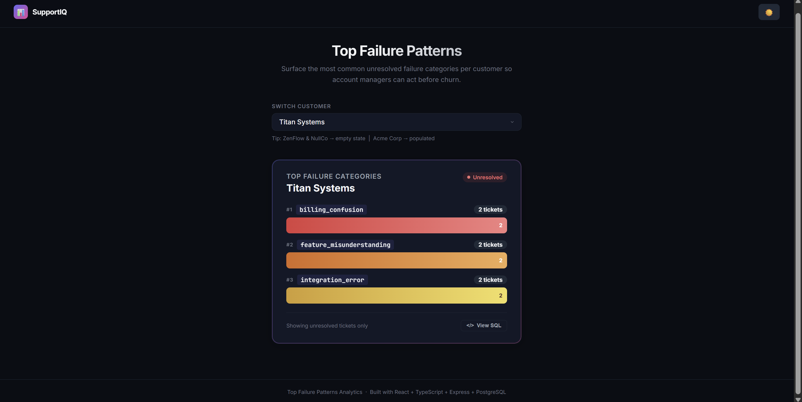
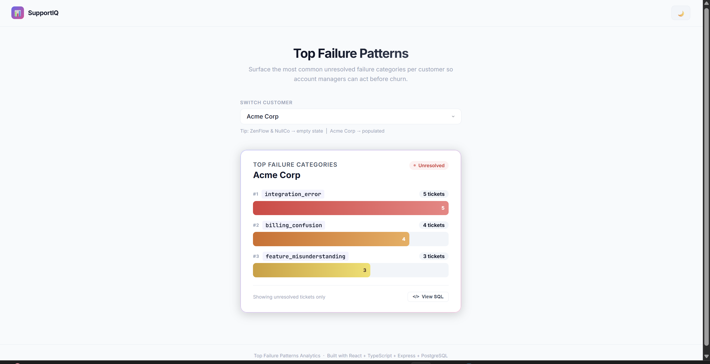
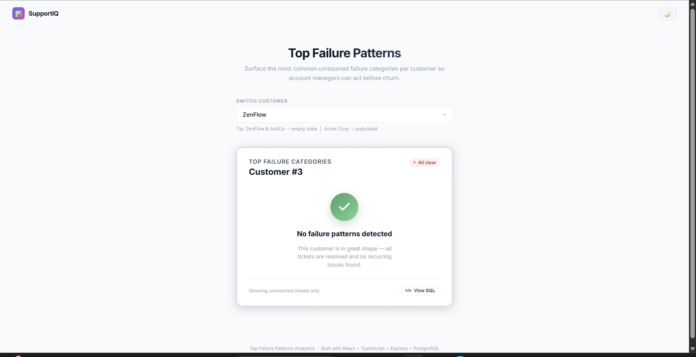
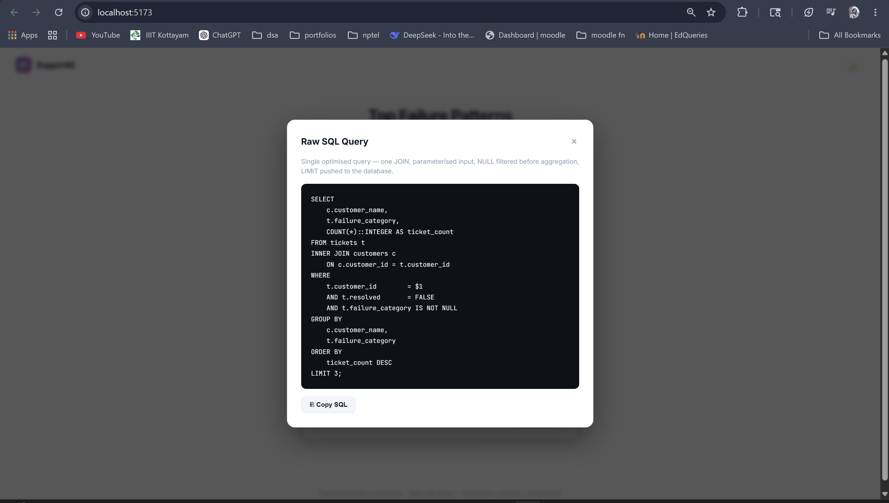

# Top Failure Patterns Analytics Widget

A full-stack analytics widget that surfaces the **top 3 most frequent unresolved failure categories** per customer, enabling account managers to proactively address recurring support issues before churn.

**Stack:** Node.js · Express · PostgreSQL · React · TypeScript · Vite

---

## Project Structure

```
├── backend/
│   └── src/
│       ├── queries/topFailures.sql   ← standalone SQL query (key deliverable)
│       ├── db/pool.ts                ← singleton pg connection pool
│       ├── db/seed.sql               ← schema + demo data
│       ├── routes/analytics.ts       ← GET /api/analytics/top-failures/:id
│       └── index.ts                  ← Express server entry point
│
└── frontend/
    └── src/
        ├── components/TopFailureWidget/
        │   ├── index.tsx             ← widget root (state orchestration)
        │   ├── SkeletonState.tsx     ← loading skeleton
        │   ├── PopulatedState.tsx    ← bar chart
        │   ├── EmptyState.tsx        ← "all clear" state
        │   └── widget.css            ← scoped styles
        ├── components/CustomerSelector.tsx
        ├── hooks/useTopFailures.ts   ← custom data-fetching hook
        └── types/index.ts            ← shared TypeScript interfaces
```

---

## Setup & Run

### Prerequisites

- Node.js ≥ 18
- PostgreSQL running locally

### 1. Database

Create a database called `support_analytics`, then run the seed file in pgAdmin Query Tool or `psql`:

```sql
-- paste contents of backend/src/db/seed.sql and execute
```

### 2. Backend

```bash
cd backend
copy .env.example .env        # then edit DATABASE_URL with your postgres password
npm install
npm run dev                   # → http://localhost:3001
```

### 3. Frontend

```bash
cd frontend
npm install
npm run dev                   # → http://localhost:5173
```

---

## SQL Query

Standalone file: `backend/src/queries/topFailures.sql`

The query uses a deterministic secondary sort on `failure_category` so the top 3 categories stay stable even when counts are tied.

```sql
SELECT
    c.customer_name,
    t.failure_category,
    COUNT(*)::INTEGER AS ticket_count
FROM tickets t
INNER JOIN customers c
    ON c.customer_id = t.customer_id
WHERE
    t.customer_id        = $1
    AND t.resolved       = FALSE
    AND t.failure_category IS NOT NULL
GROUP BY
    c.customer_name,
    t.failure_category
ORDER BY
  ticket_count DESC,
  t.failure_category ASC
LIMIT 3;
```

**Optimisation rationale:**

- Single `INNER JOIN` — one DB round-trip, no N+1
- `IS NOT NULL` in `WHERE` — rows discarded before aggregation (cheaper than `HAVING`)
- Parameterised `$1` — prevents SQL injection, enables query plan caching
- `LIMIT 3` at DB level — no in-application slicing
- Partial index on `(customer_id, resolved) WHERE resolved = FALSE` keeps the index small

---

## API

Frontend and backend are decoupled via REST API communication.

### `GET /api/analytics/top-failures/:customer_id`

**Populated response:**

```json
{
  "customerId": 1,
  "customerName": "Acme Corp",
  "data": [
    { "failure_category": "integration_error", "ticket_count": 5 },
    { "failure_category": "billing_confusion", "ticket_count": 4 },
    { "failure_category": "feature_misunderstanding", "ticket_count": 3 }
  ]
}
```

**Empty response:**

```json
{
  "customerId": 3,
  "customerName": null,
  "data": []
}
```

### `GET /api/health`

```json
{ "status": "ok", "db": "connected" }
```

---

## Demo Customers

| Customer      | ID  | Widget State                     |
| ------------- | --- | -------------------------------- |
| Acme Corp     | 1   | Populated — 3 failure categories |
| Bright Labs   | 2   | Populated — 2 categories         |
| ZenFlow       | 3   | Empty — all tickets resolved     |
| NullCo        | 4   | Empty — no tickets at all        |
| Titan Systems | 5   | Populated — 3-way tie            |

Use the customer dropdown in the UI to switch between states.

---

## Widget States

| State         | Trigger                | Behaviour                                                              |
| ------------- | ---------------------- | ---------------------------------------------------------------------- |
| **Loading**   | Data is being fetched  | Animated skeleton bars                                                 |
| **Populated** | `data.length > 0`      | Horizontal bar chart with rank labels, gradient fills, animated growth |
| **Empty**     | `data.length === 0`    | "No failure patterns detected — this customer is in great shape"       |
| **Error**     | Network/server failure | Error message with retry button                                        |

The UI also includes a **View SQL** modal so reviewers can inspect the query optimisation approach directly from the frontend.

---

## Screenshots

The captured screenshots below show the populated, empty, and SQL-review states used in the submission. The loading skeleton is implemented in the widget and is documented above.

### Populated state: Titan Systems



This capture shows the highest-volume customer view with a tied top-3 ranking, demonstrating that the query still returns a stable ordered result.

### Populated state: Acme Corp



This capture shows a normal populated state with three distinct failure categories and their ticket counts rendered as horizontal bars.

### Empty state: ZenFlow



This capture shows the empty state message for a customer with no unresolved failure patterns, confirming the widget handles the zero-data case cleanly.

### SQL modal



This capture shows the raw SQL review modal, which lets reviewers inspect the optimisation approach directly from the UI.
